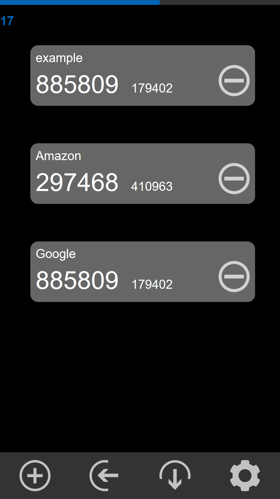

# twosteps
A 2FA key generator for Windows 10 Mobile

* uses [qcode-decoder by Ciro S. Costa](https://github.com/cirocosta/qcode-decoder)
* uses sources of [totp.js by Zach Lankton](https://gist.github.com/zachlankton/bf0ec610d044e793a1a9cccef6170e97)

It should work fine with all current OTP codes, but please double check with another authenticator (like Google Authenticator) before you lock yourself out. 

